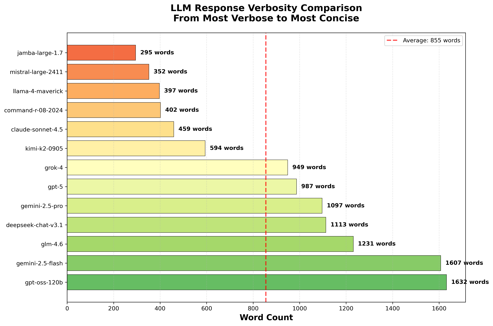

# Single-Shot Brevity Training

A framework for evaluating and training LLMs to provide concise, informative responses without excessive verbosity.

## The Problem

LLM responses often suffer from excessive verbosity - providing lengthy explanations when users want direct, actionable answers. While some context is useful, many models default to "professor mode" with unwanted educational content.

Finding the right balance is challenging: responses should be informative but not overwhelming, structured but not bloated.

## The Approach

This project implements a two-phase approach:

### Phase 1: Baseline Evaluation
Evaluate 10 diverse models (different providers, sizes, architectures) using a standardized test prompt to identify which model naturally provides the best balance of brevity and informativeness in vanilla configuration (no system prompting).

**Rationale**: Before implementing system prompts or fine-tuning, start with the model that's closest to the desired output style.

### Phase 2: Single-Shot Training
Use the best baseline model and implement "single-shot training" via system prompt - provide one example of the desired response style to guide future responses.

**Rationale**: Demonstrating the desired format with a concrete example is more effective than abstract instructions about "being concise."

## Repository Structure

```
Single-Shot-Brevity-Training/
├── prompts/                    # Test prompts
│   └── test-prompt.md         # Standard evaluation prompt
├── system-prompts/            # System prompts for single-shot training
├── data/                      # Reference responses
│   ├── chatgpt-verbose-response.md      # Example of too-verbose output
│   └── ideal-brevity-response.md        # Edited to ideal brevity
├── iteration/                 # Single-shot training implementation
│   ├── responses/             # Raw model responses (JSON)
│   ├── examples/              # Optimized brief response examples
│   └── system-prompts/        # Model-specific system prompts with examples
├── evaluation/                # Evaluation framework
│   ├── scripts/
│   │   └── evaluate_models.py    # Main evaluation script
│   ├── responses/             # Model response data
│   │   ├── json/              # Raw JSON responses with stats
│   │   └── markdown/          # Human-readable response formats
│   ├── analysis/              # Analysis results and visualizations
│   │   ├── verbosity_analysis.png      # Comprehensive 4-panel chart
│   │   └── verbosity_bar_chart.png     # Focused comparison chart
│   ├── requirements.txt       # Python dependencies
│   └── README.md             # Evaluation documentation
├── docs/                      # Project documentation
│   ├── project-rationale.md   # Why this matters
│   └── model-selection.md     # 10 models chosen and why
└── README.md                  # This file
```

## Quick Start

### Prerequisites
- Python 3.8+
- OpenRouter API key

### Running an Evaluation

1. Clone the repository:
   ```bash
   git clone https://github.com/danielrosehill/Single-Shot-Brevity-Training.git
   cd Single-Shot-Brevity-Training
   ```

2. Set up your OpenRouter API key:
   ```bash
   export OPENROUTER_API_KEY='your-key-here'
   ```

3. Install dependencies:
   ```bash
   pip install -r evaluation/requirements.txt
   ```

4. Run the evaluation:
   ```bash
   python evaluation/scripts/evaluate_models.py
   ```

5. Review results in `evaluation/results/[timestamp]/`

## Models Evaluated

The framework tests 10 carefully selected models:

1. **Anthropic Claude 3.5 Sonnet** - Balanced, professional
2. **Anthropic Claude 3 Haiku** - Designed for speed/efficiency
3. **OpenAI GPT-4o** - Latest GPT-4 variant
4. **OpenAI GPT-4o Mini** - Faster, more concise
5. **Google Gemini 2.0 Flash** - Fast inference
6. **Meta Llama 3.3 70B Instruct** - Open source baseline
7. **Mistral Large** - Known for directness
8. **DeepSeek V3** - Efficient reasoning
9. **Qwen 2.5 72B Instruct** - Strong instruction following
10. **Cohere Command R+** - Business-focused

See [docs/model-selection.md](docs/model-selection.md) for detailed rationale.

## Test Prompt

The evaluation uses a real-world product recommendation prompt (power bank selection) that:
- Is genuinely useful when it works well
- Tends to trigger verbose "professor mode" in some models
- Requires web search for current products
- Has clear, specific questions that can be answered concisely

See [prompts/test-prompt.md](prompts/test-prompt.md) for the full prompt.

## Evaluation Results

### Verbosity Analysis

Based on the evaluation of 14 models using the standardized test prompt, we found dramatic variation in response length:

**Key Finding:** Response length varied by **5.5x**, with the longest response containing 1,632 words versus the shortest at 295 words.

#### Rankings (Longest to Shortest)

| Rank | Model | Word Count | Verbosity Category |
|------|-------|------------|-------------------|
| 1 | openai/gpt-oss-120b | 1,632 | Extremely Verbose |
| 2 | google/gemini-2.5-flash | 1,607 | Extremely Verbose |
| 3 | z-ai/glm-4.6 | 1,231 | Very Verbose |
| 4 | deepseek/deepseek-chat-v3.1 | 1,113 | Very Verbose |
| 5 | google/gemini-2.5-pro | 1,097 | Very Verbose |
| 6 | openai/gpt-5 | 987 | Very Verbose |
| 7 | x-ai/grok-4 | 949 | Very Verbose |
| 8 | moonshotai/kimi-k2-0905 | 594 | Moderately Verbose |
| 9 | anthropic/claude-sonnet-4.5 | 459 | **Concise** |
| 10 | cohere/command-r-08-2024 | 402 | **Concise** |
| 11 | meta-llama/llama-4-maverick | 397 | **Concise** |
| 12 | mistralai/mistral-large-2411 | 352 | **Very Concise** |
| 13 | ai21/jamba-large-1.7 | 295 | **Very Concise** |

#### Statistical Summary

- **Mean:** 794 words
- **Median:** 693 words
- **Standard Deviation:** 456 words
- **Range:** 295 - 1,632 words



#### Top 5 Most Concise Models

These models provided focused, actionable responses under 460 words:

1. **ai21/jamba-large-1.7** (295 words) - Most concise overall
2. **mistralai/mistral-large-2411** (352 words) - Excellent balance
3. **meta-llama/llama-4-maverick** (397 words) - Compact yet comprehensive
4. **cohere/command-r-08-2024** (402 words) - Efficient delivery
5. **anthropic/claude-sonnet-4.5** (459 words) - Quality with conciseness

#### Most Verbose Models

Models to avoid for brevity-focused applications (or requiring additional prompting):

- **openai/gpt-oss-120b** (1,632 words) - 2x the average
- **google/gemini-2.5-flash** (1,607 words) - Nearly as verbose
- **z-ai/glm-4.6** (1,231 words) - Significantly above average

### Evaluation Metrics

Each response is analyzed for:
- **Word count** - Primary brevity metric
- **Character count** - Secondary length metric
- **Structure** - Use of headers, bullets, tables
- **Relevance** - Does it answer the specific questions?
- **Information density** - Key facts per 100 words
- **Unnecessary elaboration** - Educational content not requested

## Single-Shot Training Implementation

After identifying the most concise models through baseline evaluation, the next phase implements single-shot training to teach the desired brevity pattern.

### Process Overview

1. **Capture Baseline Responses** - Collect raw model outputs without brevity guidance
2. **Optimize for Brevity** - Edit each response to model ideal brevity while preserving key information
3. **Create System Prompts** - Build model-specific system prompts that include the optimized example

### Implementation Structure

The `iteration/` directory contains the complete single-shot training workflow:

#### 1. Raw Responses
Located in [`iteration/responses/`](iteration/responses/):
- Raw JSON responses from 5 selected models
- Includes usage statistics and metadata
- Models tested:
  - `anthropic/claude-sonnet-4.5`
  - `ai21/jamba-large-1.7`
  - `cohere/command-r-08-2024`
  - `meta-llama/llama-4-maverick`
  - `mistralai/mistral-large-2411`

#### 2. Optimized Examples
Located in [`iteration/examples/`](iteration/examples/):
- Each model's response edited for optimal brevity
- Word count reduced by 60-75% while maintaining all essential information
- Format: `{model-name}_optimized.md`
- Demonstrates the target response style

**Example optimization:**
- Original: 459 words (Claude Sonnet 4.5)
- Optimized: ~150 words
- Preserved: All tech specs, capacity limits, and 5 product recommendations

#### 3. System Prompts with Examples
Located in [`iteration/system-prompts/`](iteration/system-prompts/):
- Complete system prompts for each model
- Includes core instruction: "You are a thorough but focused assistant"
- Contains the full user query as an example
- Shows the optimized response as the expected output format
- Format: `{model-name}_system_prompt.md`

### Single-Shot Training Methodology

The system prompts use this structure:

```markdown
# System Prompt - [Model Name]

You are a thorough but focused assistant helping the user with their
questions and tasks. Provide complete, accurate information while
maintaining brevity. Structure your responses clearly using bullet
points and concise explanations. Include all essential details but
avoid unnecessary elaboration.

## Example Response Format

**User Query:**
[Full test prompt]

**Assistant Response:**
[Optimized brief response showing desired format]
```

This approach leverages single-shot learning - the model sees one concrete example of the desired brevity pattern and applies it to future responses.

### Using the System Prompts

To apply single-shot brevity training:

1. Choose the appropriate system prompt for your model from `iteration/system-prompts/`
2. Include the entire system prompt (instruction + example) in your API call
3. The model will learn from the example and apply similar brevity to new queries

**Example usage with OpenRouter:**

```python
response = requests.post(
    "https://openrouter.ai/api/v1/chat/completions",
    headers={
        "Authorization": f"Bearer {API_KEY}",
    },
    json={
        "model": "anthropic/claude-sonnet-4.5",
        "messages": [
            {
                "role": "system",
                "content": open('iteration/system-prompts/anthropic_claude-sonnet-4.5_system_prompt.md').read()
            },
            {
                "role": "user",
                "content": "Your actual query here"
            }
        ]
    }
)
```

## Project Goals

1. **Identify** which model provides the best baseline brevity
2. **Document** the optimal approach for concise-yet-informative responses
3. **Create** reusable system prompts for single-shot training
4. **Share** findings with the community to help others avoid verbose AI responses

## Use Cases

This framework is useful for:
- Product recommendation prompts
- Technical support queries
- Quick research questions
- Any scenario where direct, actionable answers are preferred over lengthy explanations

 

## License

MIT License - see LICENSE file for details

## Author

Daniel Rosehill
- Website: [danielrosehill.com](https://danielrosehill.com)
- Email: public@danielrosehill.com

 